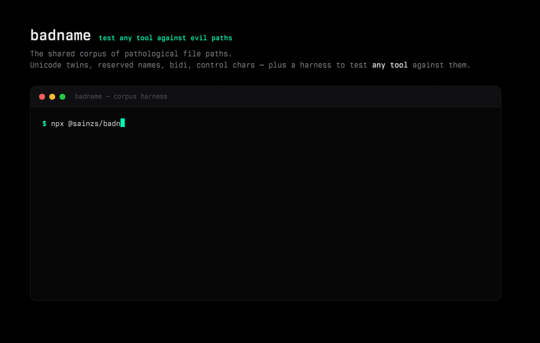

# badname

**The shared corpus of pathological file paths — and a harness to test any tool against them.**

[](https://github.com/sainzs/badname/actions/workflows/ci.yml)
[](https://www.npmjs.com/package/@ssainzs/badname)
[](LICENSE)
[](corpus/PLAIN.txt)

Every tool that touches filenames — archivers, sync engines, package managers, build systems, backup tools, and every AI coding agent's patch applier — breaks on the same names: NFC/NFD Unicode twins, Windows-reserved device names, bidi overrides, control characters, trailing dots, byte-vs-UTF-16 length limits. These bugs are individually tiny and collectively enormous, and until now there was **no shared, maintained corpus** of them. `badname` is that corpus, plus a zero-dependency CLI that puts it to work.



> Born from real bugs: the [OpenCode NFD/NFC patch-matching fix](https://github.com/anomalyco/opencode/pull/32216) and the [Kilo Code Windows path normalization fix](https://github.com/Kilo-Org/kilocode/pull/7834). The corpus encodes this entire bug class as test vectors you can run in one line.

## What it does

```sh
npx @ssainzs/badname check          # scan YOUR repo for hazardous names (read-only)
npx @ssainzs/badname roundtrip -- 'tar cf out.tar . && mkdir x && tar xf out.tar -C x && rm out.tar'
                                        # does YOUR tool mangle fixture names?
```

- **`badname check [dir]`** — read-only scan of a tree. Reports names that are corpus hazards: singleton hazards (reserved device names, glob/metachar names, invisible-character names) always flag; twin pairs (NFC/NFD, case, ligature) flag only when both twins exist in the same directory — the actual collision — so a lone `Makefile` or `café.txt` stays clean. `--all` for maximum strictness. Exits 1 on any hit. Perfect as a CI gate.
- **`badname seed [dir]`** — materializes the fixture tree into an empty sandbox (default: a fresh temp dir). Entries not creatable on your OS are skipped and reported. On normalization- or case-insensitive volumes (APFS, NTFS), colliding twins are reported as *findings* — your filesystem agreeing with the corpus.
- **`badname roundtrip -- <cmd>`** — seeds a temp sandbox, runs your shell command inside it, then reports every fixture that was **renamed, normalized, case-folded, or lost**. Exits 1 on mangling. This is the one-command fuzz test for anything that writes filenames.
- **`badname list`** — print the corpus (invisible characters escaped as `\uXXXX`).

## The corpus

150 curated entries across 19 categories, each with a one-line `why` and per-platform creatability metadata:

| Category | Example | The bug it causes |
| --- | --- | --- |
| `unicode-normalization` | `café.txt` NFC vs `café.txt` NFD | byte-compare tools see different files; patch appliers miss |
| `combining-marks` | `a` + `̈` | identical glyph, different bytes |
| `emoji-zwj` | family emoji (one grapheme, 8 codepoints) | truncation mid-cluster, byte-length math |
| `bidi-rtl` | name with U+202E override | display order ≠ logical order; spoofing |
| `control-chars` | newline / ESC in a name | log corruption, terminal escape injection |
| `bom-invisibles` | BOM, zero-width space | names that look identical, compare different |
| `windows-reserved` | `CON`, `NUL.dll`, `aux.d` | uncreatable on Windows; archive extraction fails |
| `trailing-separators` | `file. ` `file..` | Win32 silently strips; roundtrips never match |
| `separator-lookalikes` | `a:b.txt`, fullwidth `／` | structure on one OS, plain bytes on another |
| `length-limits` | 255×`a`, 128×😀 | ext4 counts bytes, APFS counts UTF-16 units |
| `case-collisions` | `README.txt` / `readme.txt`, Kelvin `K` | case-insensitive volumes collapse distinct names |
| `locale-casing` | Turkish dotless `ı`, `ß`/`SS` | locale-sensitive case mapping lies |
| `width-twins` | fullwidth `ＡＢＣ` | NFKC folds, bytes don't |
| `cli-glob-hazards` | `--flag.txt`, `*`, `` `tick` `` | shell/glob injection in tooling and agents |
| `whitespace-lookalikes` | non-breaking space | the classic "why won't this path match" |
| `deep-nesting` | 100-level trees | PATH_MAX, naive recursive walkers |
| `legacy-mojibake` | `café.txt` | double-encoded archives from old systems |
| `ntfs-streams` | `file.txt:stream` | ADS on Windows, ordinary name on POSIX |
| `dash-confusables` | minus U+2212 vs hyphen | option parsing gone wrong |

Full data: [`corpus/corpus.json`](corpus/corpus.json) (machine) · [`corpus/PLAIN.txt`](corpus/PLAIN.txt) (human). Both are generated by [`scripts/build-corpus.js`](scripts/build-corpus.js) — the single source of truth; CI fails if the committed files drift.

**Verified behavior encoded as data:** on APFS, seeding the NFC name `café.txt` and then the NFD twin fails with `EEXIST` — the filesystem is normalization-insensitive while your diff tool is not. The ligature `file.txt` (U+FB01) also collides with plain `file.txt` on APFS: a compatibility fold beyond NFC. `badname seed` surfaces these as `collided` findings.

## Use in CI

```yaml
# .github/workflows/badname.yml
on: [pull_request]
jobs:
  badname:
    runs-on: ubuntu-latest
    steps:
      - uses: actions/checkout@v4
      - uses: actions/setup-node@v4
        with: { node-version: 20 }
      - run: npx @ssainzs/badname check .
```

Or vendor `corpus/PLAIN.txt` into your own test suite — it is data, MIT-licensed, no runtime required.

## Why this exists

- **AI coding agents made it urgent.** Agents emit and consume filenames constantly; NFD-on-disk vs NFC-from-model is now a daily patch failure ([OpenCode #31651](https://github.com/anomalyco/opencode/issues/31651) → [PR #32216](https://github.com/anomalyco/opencode/pull/32216)).
- **Maintainers pay the tax.** Reserved names, trailing dots, and normalization twins arrive as "works on my machine" issues that cost hours per report.
- **The ecosystem had lists, not a corpus.** Naughty-string lists exist for *input fuzzing*; nothing carried per-platform creatability, provenance, and a roundtrip harness for *filesystem names*.

## Contributing a fixture

The best fixtures are paths that actually hurt you. See [CONTRIBUTING.md](CONTRIBUTING.md) — a new entry is one `add(...)` line in the builder plus a one-line `why`. `npm run corpus:build && npm run check` validates everything.

## Provenance

Maintained by [Santiago Sainz](https://github.com/sainzs) — contributor to [Kilo Code](https://github.com/Kilo-Org/kilocode) (merged: [#7835](https://github.com/Kilo-Org/kilocode/pull/7835), [#7832](https://github.com/Kilo-Org/kilocode/pull/7832)) and [OpenCode](https://github.com/anomalyco/opencode) ([#32216](https://github.com/anomalyco/opencode/pull/32216), [#32208](https://github.com/anomalyco/opencode/pull/32208)), where these bug classes were fixed upstream.

## License

[MIT](LICENSE) — corpus included. Use it, vendor it, break your tools with it.
